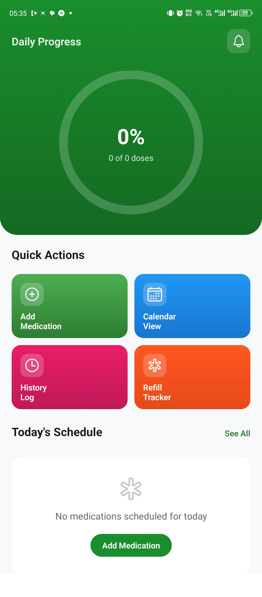

# 💊 DoseBuddy

> Smart Medication Reminder App built with **React Native** and **Expo** helping patients stay consistent with their doses, never miss a pill, and manage refill reminders effortlessly.


---
### 📱 App Preview

| Splash | Auth | Home |
|--------|------|----------|
|  |  |  |
<br>
### 📱 MOCKUPS

 | 
<br>


## 🌟 **Overview**

**DoseBuddy** is a patient-centered mobile app designed to help users take their medicine on time through smart reminders and real-time notifications.  
Built with **React Native** and **Expo Notifications**, it aims to improve medication adherence, simplify health tracking, and ensure patients never miss a dose again.

---

## ⚙️ **Key Features**

✅ **Smart Notifications** – Receive alerts exactly when it’s time to take your meds.  
✅ **Refill Reminders** – Get notified before your medicine runs out.  
✅ **Multi-Dose Scheduling** – Add multiple medications with different times.  
✅ **Cross-Platform Support** – Works seamlessly on both Android and iOS.  
✅ **Modern UI** – Minimal, clean, and easy-to-use design.  
✅ **Offline Support** – View and manage your reminders even without internet.  
✅ **Data Persistence** – Saves data locally with secure storage.

---

## 🧱 **Tech Stack**

| Layer | Technology Used |
|-------|------------------|
| Frontend | React Native (Expo) |
| Notifications | Expo Notifications API |
| Language | TypeScript |
| Styling | Tailwind CSS / React Native StyleSheet |
| Storage | AsyncStorage / SecureStore |
| Build & Deploy | Expo CLI |

---

## 🚀 **Getting Started**

Follow the steps below to set up MediPulse on your local machine.

### 1️⃣ Clone the repository
```bash
git clone https://github.com/yourusername/MediPulse.git
cd MediPulse

# Welcome to your Expo app 👋

This is an [Expo](https://expo.dev) project created with [`create-expo-app`](https://www.npmjs.com/package/create-expo-app).

## Get started

1. Install dependencies

   ```bash
   npm install
   ```

2. Start the app

   ```bash
   npx expo start
   ```

In the output, you'll find options to open the app in a

- [development build](https://docs.expo.dev/develop/development-builds/introduction/)
- [Android emulator](https://docs.expo.dev/workflow/android-studio-emulator/)
- [iOS simulator](https://docs.expo.dev/workflow/ios-simulator/)
- [Expo Go](https://expo.dev/go), a limited sandbox for trying out app development with Expo

You can start developing by editing the files inside the **app** directory. This project uses [file-based routing](https://docs.expo.dev/router/introduction).

## Get a fresh project

When you're ready, run:

```bash
npm run reset-project
```

This command will move the starter code to the **app-example** directory and create a blank **app** directory where you can start developing.

## Learn more

To learn more about developing your project with Expo, look at the following resources:

- [Expo documentation](https://docs.expo.dev/): Learn fundamentals, or go into advanced topics with our [guides](https://docs.expo.dev/guides).
- [Learn Expo tutorial](https://docs.expo.dev/tutorial/introduction/): Follow a step-by-step tutorial where you'll create a project that runs on Android, iOS, and the web.

## Join the community

Join our community of developers creating universal apps.

- [Expo on GitHub](https://github.com/expo/expo): View our open source platform and contribute.
- [Discord community](https://chat.expo.dev): Chat with Expo users and ask questions.
